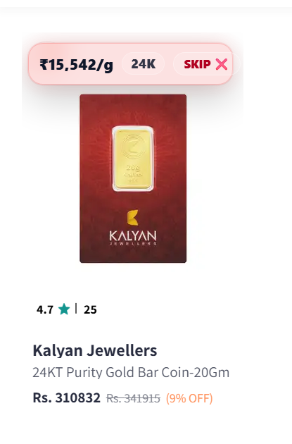
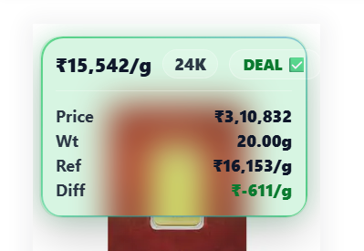
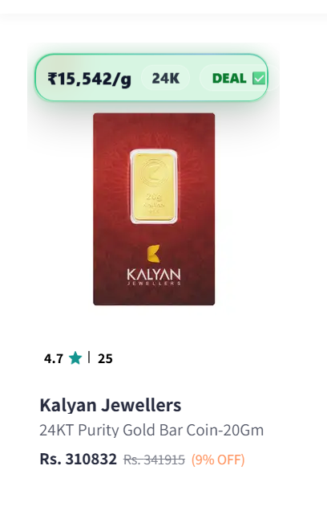
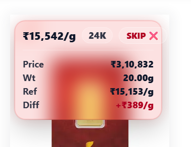
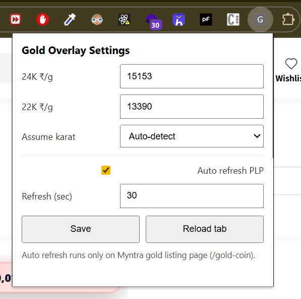

````md
# Gold Per Gram Overlay (Myntra) 🪙✨
A Chrome Extension that shows **Gold price per gram** on Myntra gold listings, compares it with your **spot price (22K / 24K)**, and highlights **DEAL / SKIP** instantly.

> ⚡ Built for quickly spotting good gold coin deals without opening each product.

---

## 🔥 Features

### ✅ Per-gram price overlay (Listing Page)
- Automatically detects **weight in grams** from the listing (supports: `g`, `gm`, `grams`, `Gms`)
- Calculates:
  - **Per gram price = Listing price / Weight**
- Shows a clean overlay on each product card

### ✅ Spot price comparison (Manual)
- You can manually enter:
  - **24K gold spot price (₹/g)**
  - **22K gold spot price (₹/g)**
- Extension compares listing per-gram price with your spot reference

### ✅ Deal detection (DEAL / SKIP)
- **DEAL ✅ (Green)** → `perGram <= spot price`
- **SKIP ❌ (Red)** → `perGram > spot price`
- Shows the difference per gram:
  - `+₹xxx/g` (red = expensive)
  - `-₹xxx/g` (green = cheaper)

### ✅ Premium UI (Glass + Hover Expand)
- Default view is a **compact single-line pill**
- On hover, expands into a **full details card**
- **Glassmorphism** blur effect + subtle glow
- **Sparkle border** for DEAL items ✨

### ✅ Auto Refresh (Configurable)
- Auto refresh listing page every **N seconds**
- Helps you not miss limited stock / fast deals

---

## 🛍 Supported Pages

| Site | Page Type | Status |
|------|----------|--------|
| Myntra | Gold Coin Listing (`/gold-coin`) | ✅ Supported |
| Myntra | Product Page (`/buy`) | ✅ Supported |
| Ajio | Listing + PDP | 🚧 Coming soon |

---

## 📌 Example Use Case

You are browsing Myntra Gold Coins and want to know:
- What is the **actual price per gram**?
- Is it cheaper than today’s **spot price**?
- Which listing is the best deal?

This extension makes it instant:
- You’ll see **₹/g** on every listing card
- You’ll see **DEAL** or **SKIP** immediately
- You don’t need to open every product

---

## 📸 Screenshots

Add your screenshots inside a folder called `screenshots/`

Example:

```md





````

---

## ⚙️ Installation (Chrome Developer Mode)

### 1) Download / Clone the Repo

```bash
git clone https://github.com/<your-username>/<your-repo-name>.git
cd <your-repo-name>
```

### 2) Load the Extension in Chrome

1. Open Chrome and go to:

   ```
   chrome://extensions
   ```
2. Enable **Developer Mode** (top-right)
3. Click **Load unpacked**
4. Select the project folder

### 3) Open Myntra Gold Coins Page

Example:

* [https://www.myntra.com/gold-coin](https://www.myntra.com/gold-coin)

---

## 🧩 Extension Settings

Click the extension icon (popup) and set:

* **24K Spot Price (₹/g)**
* **22K Spot Price (₹/g)**
* **Auto Refresh Interval (seconds)**
* Enable/Disable auto refresh

> Tip: Use a refresh interval like **20–60 seconds** depending on how aggressively you want to monitor deals.

---

## 🧠 How It Works (Internals)

On Myntra gold listing pages, the extension:

1. Reads the product **price**
2. Extracts **weight in grams** using regex:

   ```js
   const GRAMS_RE = /(\d+(?:\.\d+)?)\s*(g|gm|grams|Gms)\b/i;
   ```
3. Computes:

   ```
   perGram = price / grams
   ```
4. Detects purity (22K / 24K) if available
5. Compares with your spot price reference:

   * If `perGram <= spot` → DEAL
   * Else → SKIP
6. Displays:

   * per gram price
   * total price
   * weight
   * reference spot price
   * difference per gram

---

## ✅ Accuracy Notes

* Myntra listings may not always contain weight clearly.
* The extension tries to extract grams from:

  * Product title text
  * Brand/product metadata
  * Image alt/title text

If grams are not detected:

* it shows `₹?/g`
* marks the item as `CHECK`

---

## ⚠️ Disclaimer

This extension:

* is **NOT affiliated with Myntra**
* does **NOT** change checkout pricing
* uses **only visible page content** in your browser
* spot rates are **manual**, so always verify from your preferred source

Use at your own discretion.

---

## 🛠 Tech Stack

* Chrome Extension **Manifest V3**
* Vanilla JavaScript
* Chrome Storage Sync API
* MutationObserver (handles Myntra dynamic UI)
* Glass UI via CSS (`backdrop-filter`)

---

## 📁 Recommended Project Structure

```txt
.
├── manifest.json
├── content.js
├── styles.css
├── popup.html
├── popup.js
├── icons/
│   ├── icon16.png
│   ├── icon48.png
│   └── icon128.png
└── README.md
```

---

## 🧪 Development

### Reload after changes

1. Update code (`content.js` / `styles.css`)
2. Open:

   ```
   chrome://extensions
   ```
3. Click **Reload**
4. Hard refresh Myntra:

   * Windows/Linux: `Ctrl + Shift + R`
   * Mac: `Cmd + Shift + R`

---

## 🗺 Roadmap / Future Improvements

* [ ] Add Ajio support
* [ ] Desktop notification when a new DEAL appears
* [ ] Sort/highlight best per-gram deal automatically
* [ ] Track price history (local storage)
* [ ] Export deals list to CSV
* [ ] Support jewellery listings (not only coins)

---

## 🤝 Contributing

PRs are welcome!

Steps:

1. Fork this repo
2. Create a branch:

   ```bash
   git checkout -b feature/my-change
   ```
3. Commit changes:

   ```bash
   git commit -m "Add new feature"
   ```
4. Push:

   ```bash
   git push origin feature/my-change
   ```
5. Open a Pull Request

---

## ⭐ Support

If you find this useful:

* ⭐ Star the repo
* Share it with friends who track gold coin deals 🙂

```
```
